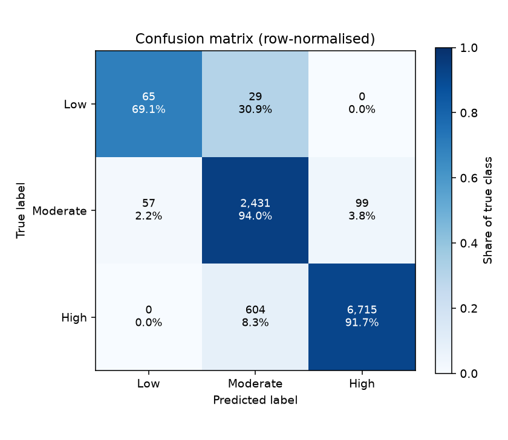
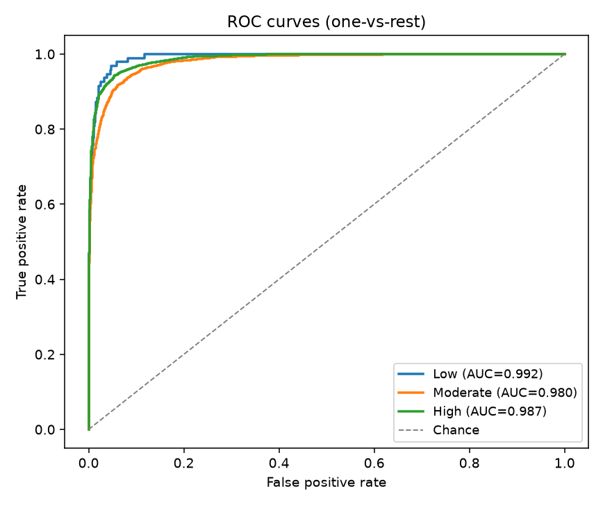
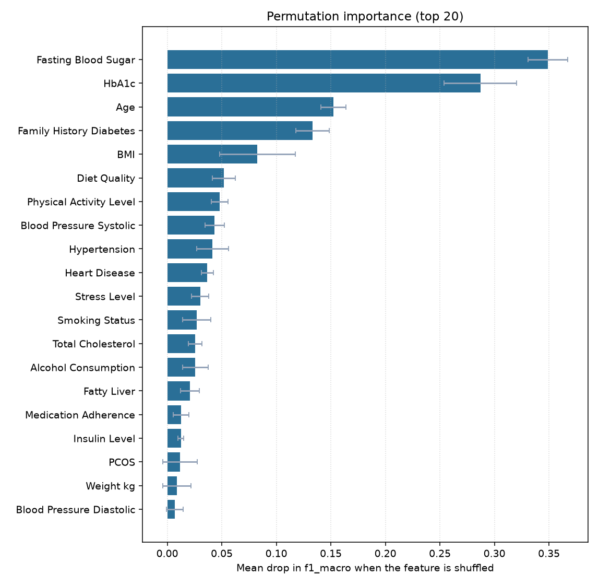

# Diabetes Risk Prediction

A complete, leakage-aware machine learning project that sorts patient profiles into three
diabetes risk bands (Low, Moderate, High) from routine clinical and lifestyle measurements.
The repository contains the full path from raw CSV to a served prediction: a reproducible
scikit-learn pipeline with imputation, scaling and one-hot encoding, model selection across
three candidate estimators by stratified cross-validation, an evaluation stage that writes
metrics and figures, command line tools for batch and single-record inference, and a small
Flask application with both an HTML form and a JSON API. Its defining feature is what it
refuses to use: three columns in the source dataset are derived from the label, and the
project drops them deliberately, documents why, and ships a flag that lets you reproduce the
inflated score they produce.

Everything needed to use or audit the model is committed: the raw 50,000-row dataset, the
stratified train/test split, the trained model (a 0.3 MB `HistGradientBoostingClassifier`
pipeline), its metadata, the evaluation metrics and figures. A fresh clone can serve
predictions immediately, and every number below can be reproduced with three commands.


> **Medical disclaimer.** This project is a machine learning demonstration built on a
> synthetic, publicly published dataset. It is **not a medical device**, it has not been
> clinically validated, and it must not be used to diagnose, screen, treat or make any
> decision about a real person. The risk bands it produces have no clinical meaning. If you
> have questions about your health, talk to a qualified clinician.

## Features

- **Target leakage handled explicitly.** `Diabetes_Risk_Score`, `AI_Health_Recommendation`
  and `Doctor_Consultation_Needed` are removed along with the `Patient_ID` identifier via a
  single `LEAKAGE_COLUMNS` constant, and a test asserts that none of them can reach the
  fitted feature names. `--keep-leakage` reproduces the inflated result on demand.
- **One preprocessing pipeline, used everywhere.** A `ColumnTransformer` (median impute +
  `StandardScaler` for numerics, most-frequent impute + `OneHotEncoder(handle_unknown="ignore")`
  for categoricals) is fitted inside cross-validation, so no imputation statistic leaks
  across folds, and the identical object serves the CLI and the web app.
- **Honest model selection.** `LogisticRegression`, `RandomForestClassifier` and
  `HistGradientBoostingClassifier` are grid-searched over small parameter grids with
  `StratifiedKFold`, scored by `f1_macro` because the Low band is well under 1% of rows.
- **Reproducible, committed artifacts.** Every run writes `models/metadata.json` with the chosen
  estimator, best parameters, CV score and standard deviation, class order, transformed
  feature names, training row count, scikit-learn version and UTC timestamp.
- **Evaluation you can look at.** `evaluate.py` writes `reports/metrics.json` plus a
  confusion matrix, one-vs-rest ROC curves and a permutation-importance chart.
- **Two ways to predict.** A JSON/CSV command line interface and a Bootstrap 5 web form with
  grouped sections, server-side range and cross-field validation, a probability bar per class
  and the model's top drivers.
- **Graceful degradation.** With no trained model on disk, every route returns a clear
  "train the model first" message and the API answers `503`, never a traceback.

## Tech stack

| Layer | Choice |
| --- | --- |
| Language | Python 3.11+ |
| Data | pandas, NumPy |
| Modelling | scikit-learn (`Pipeline`, `ColumnTransformer`, `GridSearchCV`) |
| Persistence | joblib + a JSON metadata sidecar |
| Plots | matplotlib (Agg backend, headless) |
| Web | Flask 3 application factory, Jinja2, Bootstrap 5 via CDN |
| Config | environment variables, optionally loaded from `.env` by python-dotenv |
| Tests | pytest |
| Packaging | pip, `requirements.txt` + `pyproject.toml` |

## Project structure

```
diabetes-risk-prediction/
├── app/
│   ├── __init__.py              # application factory, config, error handlers
│   ├── forms.py                 # field specs -> server-side validation (no form library)
│   ├── routes.py                # HTML routes + /api/predict, /api/health
│   ├── static/
│   │   └── css/app.css
│   └── templates/
│       ├── base.html            # layout, navbar, disclaimer banner
│       ├── index.html           # sectioned patient form
│       ├── result.html          # risk band, probability bars, top drivers
│       └── errors/
│           ├── 400.html
│           ├── 404.html
│           ├── 500.html
│           └── model_missing.html
├── data/
│   ├── raw/
│   │   └── diabetes_risk_prediction_dataset.csv   # 50,000 x 41, as published (12 MB)
│   └── processed/
│       ├── train.csv            # 40,000 rows, stratified 80%
│       └── test.csv             # 10,000 rows, stratified 20%
├── docs/
│   └── images/.gitkeep          # screenshots referenced by this README
├── models/
│   ├── model.joblib             # fitted preprocessing + HistGradientBoosting pipeline
│   └── metadata.json            # chosen estimator, params, CV scores, feature names
├── notebooks/
│   └── README.md                # suggested exploration order (no .ipynb committed)
├── reports/
│   ├── metrics.json             # held-out test metrics
│   ├── permutation_importance.json
│   └── figures/
│       ├── confusion_matrix.png
│       ├── roc_curves.png
│       └── permutation_importance.png
├── samples/
│   ├── sample_patient.json      # one record, leakage columns removed
│   └── sample_patients.csv      # 20 test-split records (4 Low, 8 Moderate, 8 High)
├── scripts/
│   └── download_data.py         # optional re-download via the Kaggle CLI
├── src/
│   ├── __init__.py
│   ├── config.py                # env-driven paths, column groups, field metadata
│   ├── data.py                  # load, validate, clean, stratified split
│   ├── features.py              # leakage drop, ColumnTransformer, estimators, grids
│   ├── prepare_data.py          # CLI: raw CSV -> data/processed/{train,test}.csv
│   ├── train.py                 # CLI: grid search -> models/model.joblib + metadata.json
│   ├── evaluate.py              # CLI: metrics.json + figures + permutation importance
│   ├── predict.py               # CLI + helpers shared with the web app
│   └── utils.py                 # logging, JSON helpers, env parsing
├── tests/
│   ├── conftest.py              # synthetic frame, tiny fitted model, Flask clients
│   ├── test_app.py
│   ├── test_artifacts.py        # the committed data, model and metrics are consistent
│   ├── test_features.py
│   └── test_pipeline.py
├── .env.example
├── .gitignore
├── LICENSE
├── pyproject.toml
├── README.md
├── requirements.txt
└── run.py                       # development server entry point
```

## The dataset

The project uses the *Diabetes Risk Prediction Dataset (50k patients)* published on Kaggle as
[`mobeenfatimah/diabetes-risk-prediction-dataset-50k-patients`](https://www.kaggle.com/datasets/mobeenfatimah/diabetes-risk-prediction-dataset-50k-patients):
50,000 rows and 41 columns covering demographics, body measurements, blood work, vitals,
lifestyle and medical history, with a three-level `Diabetes_Risk` label.

The data is **committed to this repository**, so nothing has to be downloaded:

| File | Rows | Contents |
| --- | --- | --- |
| `data/raw/diabetes_risk_prediction_dataset.csv` | 50,000 | The original CSV, unmodified |
| `data/processed/train.csv` | 40,000 | Cleaned, stratified 80% training split (seed 42) |
| `data/processed/test.csv` | 10,000 | Cleaned, stratified 20% held-out test split (seed 42) |

The processed files keep every original column, including the leakage columns, so they remain a
faithful copy of the source rows; the pipeline drops those columns itself (see below).
`python -m src.prepare_data` regenerates both splits byte for byte from the raw file.

To fetch a fresh copy from Kaggle instead (for example into another `DATA_DIR`):

```bash
python scripts/download_data.py          # uses the Kaggle CLI when available
python scripts/download_data.py --check  # just report what is on disk
```

Two properties of the data drive most of the design decisions below:

- **The classes are very unbalanced.** In the 50,000-row file the split is 36,593 High
  (73.2%), 12,937 Moderate (25.9%) and 470 Low (0.94%). Plain accuracy is therefore close to meaningless: a model
  that answers "High" every time already scores about 0.73. Selection uses `f1_macro`, splits
  and folds are stratified, and `class_weight` is set where the estimator supports it.
- **Several columns have missing values** (from 497 missing ages to 2,962 missing weights,
  i.e. 1-6% for age, height, weight, glucose, HbA1c, lipids, exercise, sleep, activity level
  and medication adherence). They are imputed **inside** the pipeline, so
  the median and the most frequent category are computed on training folds only.

## Target leakage: the columns this project refuses to use

This is the part worth reading before anything else.

The source dataset ships three columns that are not inputs to the label - they are outputs of
it:

| Column | Why it cannot be a feature |
| --- | --- |
| `Diabetes_Risk_Score` | The numeric score the label is bucketed from. In the shipped file the mapping is exact: scores 13-34 are `Low`, 35-64 are `Moderate`, 65-100 are `High`. A single threshold on this column reconstructs the target perfectly. |
| `AI_Health_Recommendation` | Advice generated *from* the risk band: each of its 15 values occurs in exactly one class (for example "Begin Diabetes Management Plan" only for `High`, "Healthy Diet Plan" only for `Moderate`), so it is a relabelled copy of the target. |
| `Doctor_Consultation_Needed` | A yes/no flag also derived from the score: all 36,593 `High` rows are `Yes`, and 417 of the 470 `Low` rows are `No`. |

**What is kept.** `HbA1c`, `Fasting_Blood_Sugar` and `Blood_Glucose` are raw laboratory
measurements, not diagnosis labels, so they stay in as features, and they are the strongest
honest predictors (see the permutation importances below). The dataset has no derived
diagnosis column such as an "HbA1c >= 6.5% means diabetic" flag; if a re-upload ever adds one,
put it in `LEAKAGE_COLUMNS`.

`Patient_ID` is dropped alongside them. It is an identifier rather than leakage in the strict
sense, but it carries no clinical signal and gives tree-based models something to memorise.

All four live in one constant, `src/config.py::LEAKAGE_COLUMNS`, and
`src/features.py::drop_excluded_columns` is the only gate into the feature frame.
`tests/test_features.py::test_fitted_feature_names_contain_no_leakage` asserts that no
transformed feature name traces back to any of them.

**See it for yourself.** Train once normally and once with the leak, then compare the CV
scores printed by each run and the two `models/metadata.json` files:

```bash
python -m src.train --model hgb                                                        # honest
python -m src.train --model hgb --keep-leakage --model-path models/leaky/model.joblib  # leaking
```

(The second command writes to `models/leaky/`, which is git-ignored, so the committed model is
not overwritten.) On the committed split the honest run scores a cross-validated `f1_macro` of
**0.8007**; the leaking run scores **1.0000 +/- 0.0000**, because the answer is sitting in the
input. Any model trained that way is worthless on a new patient, who arrives
with blood work and a lifestyle history but no risk score. The flag exists so the difference
is something you can reproduce in two commands rather than take on faith; `metadata.json`
records `"keep_leakage": true`, `evaluate.py` stamps a warning into `metrics.json`, and the
web UI shows a red banner if such a model is ever served.

## Prerequisites

- Python 3.11 or newer (scikit-learn 1.9 requires it)
- pip
- Roughly 500 MB of free disk for the virtual environment; the repository itself is about 25 MB
- Optional: a Kaggle account and API token, only if you want `scripts/download_data.py` to
  fetch a fresh copy of the CSV

## Installation

```bash
git clone <your-fork-url> diabetes-risk-prediction
cd diabetes-risk-prediction
```

Windows (PowerShell or cmd):

```bat
python -m venv .venv
.venv\Scripts\activate
python -m pip install --upgrade pip
pip install -r requirements.txt
copy .env.example .env
```

macOS / Linux:

```bash
python -m venv .venv
source .venv/bin/activate
python -m pip install --upgrade pip
pip install -r requirements.txt
cp .env.example .env
```

The defaults in `.env` already point at the committed data and model, so nothing needs editing.
Installing the project itself is optional and only needed for the `drp-*` console scripts:

```bash
pip install -e ".[dev]"
```

## Configuration

Every setting is an environment variable with a working default; `.env` is read at import time
when python-dotenv is installed. Relative paths resolve against the project root.

| Variable | Description | Default |
| --- | --- | --- |
| `DATA_DIR` | Folder holding the raw dataset CSV | `data/raw` |
| `RAW_CSV_NAME` | File name inside `DATA_DIR` | `diabetes_risk_prediction_dataset.csv` |
| `PROCESSED_DIR` | Where `train.csv` / `test.csv` are written | `data/processed` |
| `MODEL_PATH` | Fitted pipeline; `metadata.json` is written beside it | `models/model.joblib` |
| `REPORTS_DIR` | Metrics JSON and `figures/` output | `reports` |
| `RANDOM_SEED` | Seed for splitting, CV and every estimator | `42` |
| `TEST_SIZE` | Held-out fraction for the test split | `0.2` |
| `CV_FOLDS` | Stratified cross-validation folds | `5` |
| `SCORING` | scikit-learn scoring name used for selection | `f1_macro` |
| `LOG_LEVEL` | `DEBUG`, `INFO`, `WARNING`, `ERROR`, `CRITICAL` | `INFO` |
| `FLASK_ENV` | `development` enables the debug reloader in `run.py` | `development` |
| `FLASK_HOST` | Development server bind address | `127.0.0.1` |
| `FLASK_PORT` | Development server port | `5000` |
| `SECRET_KEY` | Flask session signing key - set a real value before deploying | `dev-only-insecure-key` |

## Usage

Run everything from the project root so that `import src` resolves.

The processed splits, the trained model and the reports are already in the repository, so you
can jump straight to [step 4](#4-predict) or [step 5](#5-run-the-web-app). Steps 1-3 reproduce
them from the raw CSV; on a 2-core laptop CPU the whole run takes about four minutes (training
is about 3 minutes of that).

Because the model is a pickled scikit-learn object, load it with the scikit-learn minor version
it was trained with (1.9.x, pinned in `requirements.txt`). If you change that version, retrain
with step 2.

### 1. Prepare the splits

```bash
python -m src.prepare_data --test-size 0.2 --seed 42
```

Validates the schema, cleans the frame, writes `data/processed/train.csv` and
`data/processed/test.csv`, and logs the class balance of the full dataset and of both splits.

### 2. Train

```bash
python -m src.train --model all          # grid-search all three, keep the best
python -m src.train --model logreg       # a single candidate
python -m src.train --model rf --cv 3 --n-jobs 4
python -m src.train --model hgb --max-rows 5000   # quick smoke run
python -m src.train --model hgb --keep-leakage --model-path models/leaky/model.joblib  # leakage demo
```

Writes `models/model.joblib` and `models/metadata.json`.

### 3. Evaluate

```bash
python -m src.evaluate --n-repeats 5 --top-k 20
python -m src.evaluate --no-figures       # metrics only
```

Writes `reports/metrics.json`, `reports/permutation_importance.json` and, unless
`--no-figures` is given, `reports/figures/confusion_matrix.png`, `roc_curves.png` and
`permutation_importance.png`.

### 4. Predict

```bash
# single record from a JSON file
python -m src.predict --input samples/sample_patient.json

# single record from stdin
type samples\sample_patient.json | python -m src.predict --stdin    # Windows
cat samples/sample_patient.json | python -m src.predict --stdin     # macOS / Linux

# batch scoring from CSV
python -m src.predict --input samples/sample_patients.csv --output reports/predictions.csv
```

Output for `samples/sample_patient.json` with the committed model (this patient's actual label
in the dataset is `Moderate`):

```json
[
  {
    "prediction": "Moderate",
    "probabilities": { "Low": 0.008454, "Moderate": 0.637699, "High": 0.353847 },
    "confidence": 0.637699
  }
]
```

On `samples/sample_patients.csv` (20 held-out patients, whose true label is kept in the
`Diabetes_Risk` column for comparison) the committed model gets 18 of 20 right.

### 5. Run the web app

```bash
python run.py
# then open http://127.0.0.1:5000
```

The form is grouped into Demographics, Body Metrics, Blood Work, Vitals, Lifestyle and Medical
History, pre-filled with plausible values, and validated server side (ranges per field, plus
cross-field checks such as diastolic below systolic pressure). The result page shows the
predicted band, a probability bar per class, the model's top drivers and the values you
submitted.

For anything other than local development, serve the factory through a WSGI server instead of
`run.py`:

```bash
pip install waitress
waitress-serve --port 8000 "app:create_app()"
```

## API reference

| Method | Path | Description |
| --- | --- | --- |
| `GET` | `/` | Patient form. Shows a warning banner when no model is trained. |
| `POST` | `/predict` | Form submission; renders the HTML result page. `400` with inline messages on validation failure, `503` when no model exists. |
| `POST` | `/api/predict` | Scores one JSON record. `400` on validation failure (with a per-field explanation), `503` when no model exists. |
| `GET` | `/api/health` | Service and model status. `200` when a model is loaded, `503` when it is missing. |

### `POST /api/predict`

Request - all model input fields are required; `samples/sample_patient.json` is a complete
example:

```bash
curl -X POST http://127.0.0.1:5000/api/predict \
  -H "Content-Type: application/json" \
  -d @samples/sample_patient.json
```

Response `200`:

```json
{
  "status": "ok",
  "prediction": "Moderate",
  "probabilities": { "Low": 0.008454, "Moderate": 0.637699, "High": 0.353847 },
  "confidence": 0.637699,
  "model": {
    "name": "hgb",
    "trained_at_utc": "2026-09-23T06:14:14+00:00",
    "sklearn_version": "1.9.1",
    "keep_leakage": false
  },
  "disclaimer": "This tool is a machine learning demonstration..."
}
```

Response `400` (validation failure):

```json
{
  "status": "error",
  "error": "Validation failed.",
  "fields": {
    "HbA1c": "HbA1c must be between 3 % and 18 %.",
    "Gender": "Gender must be one of: Female, Male, Other."
  }
}
```

Response `503` (no trained model):

```json
{
  "status": "error",
  "error": "Model not available. Train one first: python -m src.train (expected at 'models/model.joblib')"
}
```

The `200` response is the real output for `samples/sample_patient.json` with the committed
model; the error bodies show the shape of the `400` and `503` responses.

### `GET /api/health`

```json
{
  "status": "ok",
  "model_available": true,
  "model_path": "/path/to/diabetes-risk-prediction/models/model.joblib",
  "class_order": ["Low", "Moderate", "High"],
  "model": { "name": "hgb", "trained_at_utc": "2026-09-23T06:14:14+00:00", "cv_score": 0.800692, "keep_leakage": false }
}
```

## Screenshots

Screenshots are not committed. To populate this section, run the app locally and save the
images into `docs/images/`, then the references below will resolve:

- `docs/images/form.png` - the sectioned patient form
- `docs/images/result.png` - the result page with probability bars
```markdown


```

The evaluation figures are committed and shown in [Results](#results).

## Testing

```bash
pip install -r requirements.txt
pytest
pytest -v tests/test_features.py       # leakage and pipeline structure only
pytest -k leakage                      # the leakage assertions
```

The suite builds its own synthetic frame from the field specifications in `src/config.py` and
fits a small logistic-regression pipeline in a fixture, so it runs in seconds and needs
neither the 50k-row dataset nor a trained model. It covers:

- pipeline construction (both imputers, the one-hot encoder's `handle_unknown` setting);
- that no leakage column survives into the fitted feature names, and that `--keep-leakage`
  keeps them when asked;
- split determinism for a fixed seed, stratification and train/test disjointness;
- a full short training run that writes a model and metadata;
- prediction on `samples/sample_patient.json` and on the 20-row sample CSV, including a record
  with a missing field;
- the Flask surface: form rendering, a valid submission, an out-of-range rejection,
  `/api/health`, `/api/predict`, and every model-missing path returning guidance instead of a
  traceback;
- `tests/test_artifacts.py`: the committed files themselves - the raw CSV's schema, that the
  train/test split is disjoint and stratified, that the committed model's input columns are
  exactly the web form's fields with no leakage column, that it scores the sample patient, is
  under 25 MB, and that `reports/metrics.json` belongs to that model. These tests skip if the
  files are absent.

Lint:

```bash
ruff check .
ruff format --check .
```

## Results

Measured on 2026-09-23 with scikit-learn 1.9.1 by running, from the committed raw CSV:

```bash
python -m src.prepare_data          # seed 42, 80/20 stratified split
python -m src.train --model all     # 5-fold stratified CV grid search, f1_macro
python -m src.evaluate              # held-out test split, 10,000 rows
```

The outputs are the committed `models/metadata.json`, `reports/metrics.json`,
`reports/permutation_importance.json` and `reports/figures/*.png`.

### Model selection (5-fold CV on the 40,000-row training split)

| Candidate | Grid | Best CV `f1_macro` |
| --- | --- | --- |
| Logistic regression (balanced) | `C` in {0.1, 1, 10} | 0.6886 |
| Random forest (150 trees, balanced) | `max_depth` in {12, 18} x `min_samples_leaf` in {10, 25} | 0.7749 |
| **HistGradientBoosting** | `learning_rate` in {0.05, 0.1} x `class_weight` in {None, balanced} | **0.8007 +/- 0.0066** |

The winner uses `learning_rate=0.1` and `class_weight="balanced"`. The forest's depth and leaf
size are capped so that even a winning forest would stay a few MB on disk; the saved gradient
boosting pipeline is 0.3 MB.

### Held-out test set (10,000 rows)

| Metric | Value |
| --- | --- |
| Accuracy | 0.9211 |
| Balanced accuracy | 0.8496 |
| F1 (macro) | 0.8042 |
| F1 (weighted) | 0.9237 |
| ROC-AUC (one-vs-rest, macro) | 0.9863 |

| Class | Precision | Recall | F1 | ROC-AUC (OvR) | Support |
| --- | --- | --- | --- | --- | --- |
| Low | 0.533 | 0.691 | 0.602 | 0.992 | 94 |
| Moderate | 0.793 | 0.940 | 0.860 | 0.980 | 2,587 |
| High | 0.985 | 0.917 | 0.950 | 0.987 | 7,319 |

Confusion matrix (rows are the true class):

| | Predicted Low | Predicted Moderate | Predicted High |
| --- | --- | --- | --- |
| **Low** | 65 | 29 | 0 |
| **Moderate** | 57 | 2,431 | 99 |
| **High** | 0 | 604 | 6,715 |

Errors happen almost entirely between neighbouring bands; no Low patient is called High or the
other way round. Balanced class weights buy Low-band recall (0.69) at the cost of precision
(0.53), and the largest single error is 604 High patients called Moderate.




### What drives the predictions

Permutation importance on 2,000 test rows (5 repeats, drop in `f1_macro`):

| Feature | Mean drop in F1 (macro) |
| --- | --- |
| Fasting blood sugar | 0.349 |
| HbA1c | 0.287 |
| Age | 0.152 |
| Family history of diabetes | 0.133 |
| BMI | 0.083 |
| Diet quality | 0.052 |
| Physical activity level | 0.048 |



With 73% of rows in one class, a model that always answers "High" already scores 0.73
accuracy, so quote `f1_macro` and per-class recall rather than accuracy when comparing runs.
The Low band has only 94 test patients, so its metrics move noticeably with a different seed.

## Roadmap and limitations

Limitations, plainly:

- **The data is synthetic.** It was generated for a Kaggle exercise, not collected from
  patients. Relationships in it need not resemble real physiology, so nothing learned here
  transfers to clinical practice.
- **The Low band is tiny** (under 1% of rows, a few hundred patients). Per-class metrics for
  it are unstable, and a different seed can move them noticeably.
- **The labels are bucketed from a formula**, not from diagnoses or outcomes. Once the score
  is removed, the task is to recover that formula from its inputs - a well-posed modelling
  exercise, but not an epidemiological one.
- **Feature importances are global, not per-patient.** The result page says so; the numbers
  come from permutation importance on the held-out split, or from the estimator's own
  importances or coefficients as a fallback.
- **No calibration.** Probabilities are the estimator's raw outputs and have not been checked
  with a reliability curve.
- **The app is a demo.** No authentication, no rate limiting, no persistence, and the
  development server is not for production use.

Possible next steps:

- Probability calibration (`CalibratedClassifierCV`) and a reliability plot in `evaluate.py`.
- SHAP values for genuine per-record attribution on the result page.
- A `GroupKFold` or temporal split if a version of the data ever gains repeat visits.
- A Dockerfile and a GitHub Actions workflow running `pytest` and `ruff` on each push.
- Threshold tuning per class, so the Low band can be traded off explicitly instead of
  implicitly.
- Persisting submissions and predictions so drift can be monitored over time.

## License

The code is released under the MIT License. See [LICENSE](LICENSE). The dataset in `data/` is
a copy of the Kaggle dataset linked above and remains subject to the terms its publisher set
there; check them before reusing the data outside this project.
